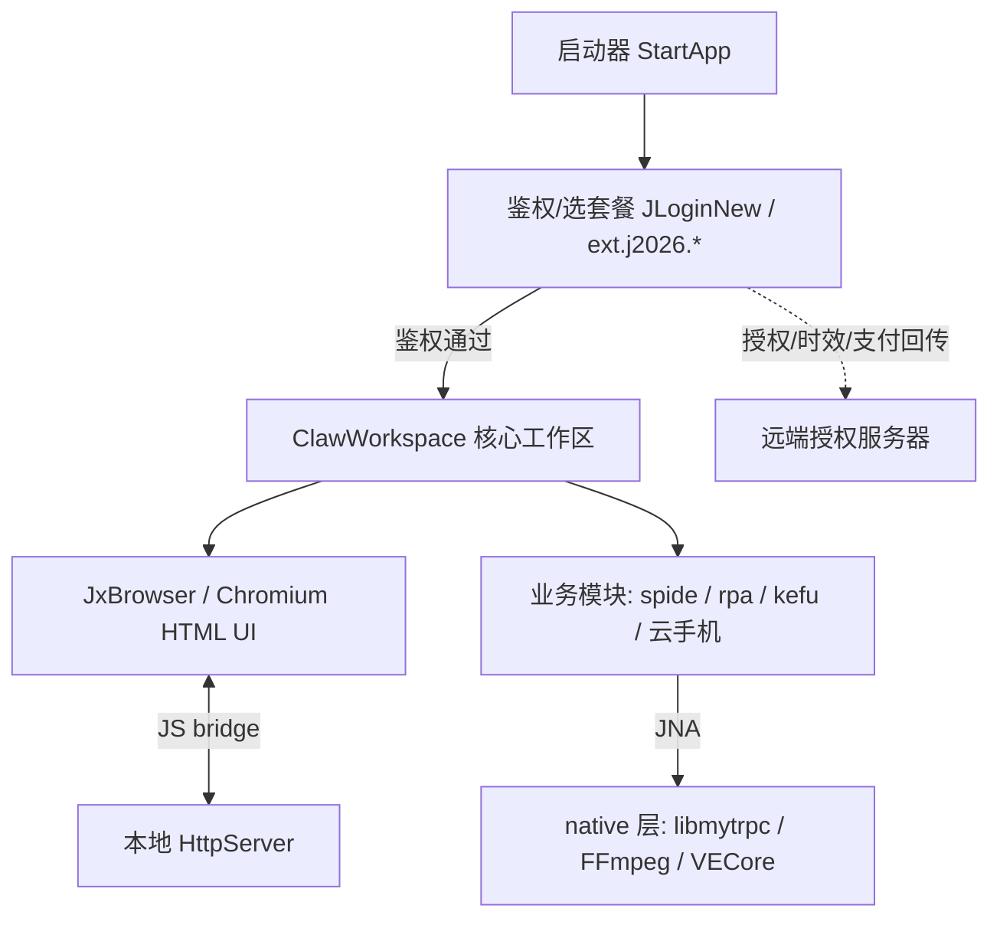

# 火柴AI 客户端逆向与单机化 设计说明

## 0 问题一句话

在只有客户端编译产物、服务器不可动的条件下，还原足够可读的源码谱，并只在客户端“授权握手”接缝处做最小改动，让应用免登录进入主界面且不破坏业务联网。

## 1 领域模型（核心实体与关系）

- 客户端资产：当前可操作范围，仅包含安装包、JAR/DLL、配置和资源文件。
- 授权层：负责登录、套餐、时效、支付状态回传，是本期唯一允许改动的业务接缝。
- 工作区层：鉴权通过后进入 `ClawWorkspace`，负责承载 UI 与业务模块。
- UI 层：JxBrowser 加载本地 HTML，通过 JS bridge 和本地 HttpServer 与 Java 逻辑交互。
- 业务模块：采集、RPA、客服、云手机等真实业务能力，必须保持联网可用。
- native 层：`libmytrpc`、FFmpeg、VECore 等原生组件一律不改，只作黑盒复用。
- 服务端：导师维护的远端资产，不属于本项目操作范围。

## 2 可预见的变化轴

| 维度 | 当前形态 | 未来可能 | 本次是否预留 | 理由 |
| --- | --- | --- | --- | --- |
| 授权服务端返回体 | 协议和返回内容未知，且不由本项目控制 | 服务端接口、字段或状态码变化 | 是 | 把变化收敛到客户端唯一鉴权判定点，后续只维护这一点 |
| 字符串解密方式 | ProGuard 混淆，存在字符串/资源加密 | 静态纯函数不可解，需要运行时上下文 | 是 | 先静态反射批量解，失败后切换 javaagent/Frida 动态 dump |
| 业务联网依赖 | 采集、云手机等功能必须联网 | 业务请求可能轻度依赖授权 token | 否 | 本期先通过抓包和流程验证确认，不提前改业务链路 |
| native 签名逻辑 | `libmytrpc` 黑盒签名 | 平台升级可能导致签名失效 | 否 | 与本期去授权无关，任何 native 改动都会增加业务失效风险 |
| 全量重写 | 当前目标是逆向可用和可读 | 后续可能干净重构 | 否 | 本期先产出业务文档和源码谱，不为重写提前抽象 |

### 防耦合规则

- 只为“确定会来”的变化预留扩展点，其余一律 YAGNI。
- 预留前先判断：这是本质复杂度，还是附加复杂度？
- 新想法先进入 `task-breakdown.md` 的范围外区，未经批准不进入实现。

## 3 模块拆分与接口契约

| 模块 | 输入 | 输出 | 不变量 |
| --- | --- | --- | --- |
| 反编译与资产清点 | 安装包、App.dll/JAR、配置、资源 | 可浏览源码树、`assets.md` | 不修改原始资产，先备份再分析 |
| 字符串解密 | 混淆字面量、解密函数、运行时上下文 | `string_map.json` | 明文映射可追溯，可用于全局检索 |
| 授权握手接缝 | 启动上下文、本地许可状态、服务端返回体 | `AuthResult { ok: true; expireAt: permanent; plan: all_unlocked }` | 只改返值或状态，不删 UI、不改下游业务调用链 |
| 联网边界验证 | 抓包记录、功能流程日志 | 授权请求与业务请求分类结果 | 只断授权/支付/时效回传，不误伤采集和云手机 |
| 验证记录 | 每次改动前后行为、抓包结论 | `verify.log` | 每个结论能回到具体改动和回滚点 |

授权握手接缝错误枚举原本可能包含 `NETWORK_FAIL`、`EXPIRED`、`UNPAID`、`INVALID_LICENSE`。改造后这些错误路径不再对启动主流程可达，鉴权点恒走 ok 分支。若必须改变该契约，先写 ADR 并等待批准。

## 4 技术选型

### 项目真正关心什么约束

约束优先级为：不惊动服务器 > 不弄坏业务联网与 native 签名 > 接缝最小化且可回滚 > 可读可重构。

| 选项 | 利 | 弊 | 与约束匹配度 |
| --- | --- | --- | --- |
| 鉴权结果判定点短路返值 | 改动面最小，可回滚，不需要删除登录模块 | 需要先准确定位接缝，找错会黑屏或闪退 | 高 |
| 删除登录模块或大面积改 UI | 表面直观 | 容易破坏启动链路和状态依赖，难回滚 | 低 |
| 客户端本地静默短路授权结果 | 不需要访问服务器，不制造失败请求 | 需要区分授权与业务请求 | 高 |
| hosts 封域名或拦截所有网络 | 操作简单 | 容易误伤业务联网，也可能制造异常重试 | 低 |
| 保留 native 黑盒复用 | 最大限度保护业务签名链路 | 不能解释全部原生内部逻辑 | 高 |

### 反造火箭自检

本期不做框架化重写、不引入额外抽象层、不改 native、不做服务端替身。只围绕可运行、可定位、可验证的最薄切片推进。

## 5 非功能需求（NFR）

- 可回滚：每改一处先备份原 JAR/原类，记录 diff 和回滚点。
- 可归因：启动、鉴权、进入主界面、业务联网每一步都要有独立验证证据。
- 静默：授权请求应在客户端本地短路，不反复重试，不产生异常请求风暴。
- 兼容：业务联网和 native 签名链路不受去授权改动影响。
- 可读：逆向产物必须能沉淀为 `string_map.json`、`seams.md`、`assets.md` 和业务模块文档。
- 合规边界：仅处理自有客户端本地资产，自用学习，不传播不商用。

## 6 Walking Skeleton

M1 最薄可运行切片：完成环境备份，使用 JADX 全量反编译导出可浏览源码树，确认原始客户端/JAR 在隔离环境中能够启动，并记录启动行为。验收点是能打开源码树、能运行原始产物、能开始定位 `StartApp` 与 `JLoginNew` 等入口。

## 7 最高风险与降险顺序（De-risk first）

| 风险 | 为什么高 | 先验证什么 | 降险动作 |
| --- | --- | --- | --- |
| 字符串解密失败 | 关键类名和授权路径不可读，无法可靠定位接缝 | 解密函数是否可纯函数反射调用 | 先批量静态解密，失败再做运行时 dump |
| 鉴权接缝定位错误 | 可能导致黑屏、闪退或绕过了错误位置 | `StartApp` 到 `ClawWorkspace` 的调用链和分支条件 | 隔离虚机快照，小步 patch，小步启动验证 |
| 误伤业务联网 | 去授权若切断通用网络层，采集和云手机会挂 | 抓包区分授权域名/接口与业务接口 | 只短路授权结果，不封全域名，不改业务请求 |
| 服务器察觉异常 | 大量失败请求或异常上报可能惊动导师服务器 | 授权请求频率和失败重试行为 | 本地秒返/缓存式短路，避免远端失败重试 |
| native 签名失效 | 业务平台请求依赖 `libmytrpc` 签名 | 业务接口是否出现 4xx 或签名错误 | native 一律不改，发现签名错误先回滚客户端改动 |
