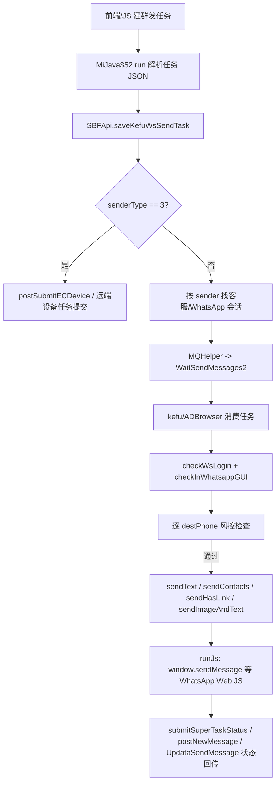

# 路 B 摸底侦察：发送 + 防封 / 频控逻辑报告

结论：**通**。原厂“发送全链路 + 核心防封 / 频控逻辑”已摸清，足够作为我们自建“滴水群发”模块的设计蓝本。

需要注意两点：

- 未发现明确的“每号每天上限 / 每小时上限 / 固定时间段限制 / 新号 warmup / 健康分评分”硬逻辑；这些建议我们自建时主动补齐。
- 本轮只读侦察，未发真实消息、未改功能、未覆盖 live、未碰 `.cnf / cloud.spider.b / libmytrpc / 系统时钟 / 采集链`。

## 0. 收口复核

| 项 | 结果 |
|---|---|
| git status | clean |
| live App SHA | `77EECE425555206A3213EAA405504B287D8D20CBF70F5B8226B43BA7404CEEAE` |
| live config SHA | `D55D539C3718F2C63B160349539F15148B9FACAAD60BF0242F6FB5A0458302DE` |
| live DB SHA | `DB1292C3EE4EA6DF4989B8D18BB939203B1401476663BCC5D8E5639E10F3795C` |
| live 口径备注 | 用户口径提到 D046；现场复算实际 live App SHA 为 `77EE...CEAE`，本轮未改 |
| 残留进程 | 观察到一个既存 `java.exe` 指向旧 `.artifacts\working\b1c-wa-multiprofile-run\...\StartApp`，非本轮启动，按只读边界未处理 |

## 1. 发送链路调用图

## 2. 发送链路实证

### 2.1 任务入口：`MiJava$52`

`MiJava$52.run` 是群发任务桥接入口，解析的核心字段：

- `taskSeq`
- `contentType`
- `contentTxt`
- `sender`
- `senderType`
- `taskType`
- `destType`
- `forwardType`
- `res_type`
- `channelTotal`
- `alldatas`

任务类型包括：

- `WhatsappMassSending`
- `VideoCall`
- `JoinGroup`
- `ImportAddressBook`
- `FollowChannel`
- `forwardVoice`
- `dynamics`

提交逻辑：

- 先通过 `SBFApi.a(...)` 调 `/api/v1/superwhatsapp/saveKefuWsSendTask/` 创建设备/客服发送任务。
- `senderType == 3` 时走远端设备任务提交分支。
- 否则按 `sender` 找到本地客服/WhatsApp 会话，将单条任务投入 `WaitSendMessages2` 队列。

### 2.2 后端接口：`SBFApi`

确认存在以下接口：

| 接口 | 作用 |
|---|---|
| `/api/v1/superwhatsapp/saveKefuWsSendTask/` | 保存客服 WhatsApp 发送任务 |
| `/api/v1/superwhatsapp/postSendTask2vps/` | 将发送任务推到 VPS/远端执行侧 |
| `/api/v1/superwhatsapp/postSubmitECDevice/` | 提交 EC 设备任务 |
| `/api/v1/superwhatsapp/submitSuperTaskStatus/` | 提交 super task 状态 |
| `/api/v1/superwhatsapp/updateZwWidDeadNumber/` | 标记死号/失效号 |
| `/api/v1/client/pc/postNewMessage` | 新消息/会话状态上报 |
| `/api/v1/client/pc/UpdataSendMessage/` | 更新发送消息状态 |

`saveKefuWsSendTask` 的 JSON 参数字段：

- `content`
- `sender`
- `contentType`
- `taskType`
- `destType`
- `dests`
- `total`
- `tenantCode`
- `loginName`
- `module`

`postSubmitECDevice` 的 JSON 参数字段：

- `taskSeq`
- `dests`
- `type`
- `url`
- `extend`

`submitSuperTaskStatus` 传入 `JSONArray`，返回 `result` 成功与否。

### 2.3 执行侧：`ADBrowser.doStartSendAll`

`ADBrowser.doStartSendAll(JSONObject)` 是 WhatsApp Web 执行侧批量发送入口。

顶层读取：

- `rdata`
- `alldatas`
- `sender`
- `zwuuid`
- `taskSeq`
- `contentTxt`
- `sendingMechanism`

每条 `alldatas` 读取：

- `contentType`
- `contentText`
- `destPhone`
- `randominterval1`
- `randominterval2`

支持的发送类型：

- `text`
- `card`
- `haslink`
- `textAndImage`

最终通过注入 JS 调 WhatsApp Web：

- `window.sendMessage(arguments[0], arguments[1])`
- `window.sendHasLink(arguments[0], arguments[1], arguments[2])`
- `window.wap_sendContacts(arguments[0], arguments[1])`
- `window.my_sendImageAndTextMsgToChat(arguments[0], arguments[1], arguments[2], arguments[3], arguments[4])`

### 2.4 `wsClientSendMsg`

`wsClientSendMsg` 是旁路直发桥，不是群发主队列。

- `MiJava$38`：`StartApp.m(sessionId)` 找到 `com.sbf.main.ext.v`，再调用 `v.send(String)`。
- `MiJava$39`：同理，但调用 `v.send(byte[])`。
- JS callback 返回：
  - `1`：成功
  - `0`：找不到会话
  - `-1`：异常

## 3. 频控 / 滴水参数清单

| 字段 | 位置 | 默认值 | 单位 / 语义 |
|---|---:|---:|---|
| `randominterval1` | 每条 `alldatas` | 无执行侧默认 | 发送后随机 sleep 下限，毫秒 |
| `randominterval2` | 每条 `alldatas` | 无执行侧默认 | 发送后随机 sleep 上限，毫秒 |
| `sendingMechanism` | 任务顶层 | 未见默认 | 发送机制；在超链素材中表现为随机 / 轮询 |
| `reply_time_interval_s1` | `ADBrowser` 构造器 | `10` | 自动回复旧客间隔下限 |
| `reply_time_interval_s2` | `ADBrowser` 构造器 | `20` | 自动回复旧客间隔上限 |
| `new_reply_time_interval_s1` | `ADBrowser` 构造器 | `10` | 新粉/新客回复间隔下限 |
| `new_reply_time_interval_s2` | `ADBrowser` 构造器 | `20` | 新粉/新客回复间隔上限 |
| `reply_time_interval_random_range_min` | 自动回复任务 | 未完全追默认 | 自动回复随机区间下限 |
| `reply_time_interval_random_range_max` | 自动回复任务 | 未完全追默认 | 自动回复随机区间上限 |
| `max_reply_count` | 自动回复任务 | 未完全追默认 | 自动回复上限 |
| `replyMaxTotal` | 指纹任务配置 | 未完全追默认 | 自动回复上限/任务上限 |
| `period_interval` | 周期任务 | 未完全追默认 | 周期执行间隔，非群发主链路 |
| `startTime` | 周期任务 | 未完全追默认 | 周期任务开始时间，非群发主链路 |
| `repeat_count` | 周期任务 | 未完全追默认 | 周期重复次数，非群发主链路 |

关键确认：

- `randominterval1/2` 使用 `MD5Util.a(min,max)` 随机。
- 随机值直接传给 `Thread.sleep(...)`。
- 日志将随机值 `/ 1000` 显示成“X 秒后执行下一任务”，所以该字段应按毫秒存。

未发现明确字段：

- 每号每天上限
- 每号每小时上限
- 固定发送时间窗
- 分批大小
- 新号 warmup 阶梯
- 健康分限速

## 4. 养号 / 防封 / 风控策略

已确认存在：

### 4.1 登录态和页面态检查

发送前会等待 WhatsApp 登录。

- `kefu n2025` 路径最多等待约 60 秒。
- 未登录则取消任务。
- WhatsApp 页面未正常进入 / 数据未加载完，也会取消任务。

相关日志文案：

- `等待Whatsapp登录`
- `已登录Whatsapp,检查界面`
- `Whatsapp 正常，开始处理任务`
- `Whatsapp 尚未正常进入页面,可能未加载完数据,取消任务`
- `当前未登录Whatsapp ,取消任务`

### 4.2 逐号码风控检查

任务字段：

- `openWsPreventiveRiskControl`
- `enabledReasonCheck`

开启后，对每个 `destPhone` 做 reason check。

接口返回字段：

- `status`
- `reason`

已确认 reason：

- `possible_migration`
- `blocked`

处理逻辑：

- 命中 `blocked`：写失败状态，日志 `已封号 跳过发送`。
- 其他 reason：写失败状态并记录 reason。
- 正常：继续发送。

### 4.3 失败状态

执行侧构造逐条结果：

- `destPhone`
- `sendTime`
- `status`
- `msg`

常见状态：

- `1`：发送成功或已执行
- `-1`：未登录 / 页面异常 / 执行失败
- `-2`：封号 / blocked
- `-3`：其他 reason 风控失败

未发现：

- 新号 warmup 自动日程
- 账号健康度评分
- 连续失败后自动降速
- 指数退避
- 达阈值自动停号

## 5. 多号协同 / 指纹 / 代理隔离

已确认字段和机制：

### 5.1 按发送号隔离任务

任务 payload 带：

- `sender`
- `senderType`

执行时按 `sender` 找对应客服 / WhatsApp 会话，不是全局裸队列。

### 5.2 本地队列

本地队列名：

- `WaitSendMessages2`

指纹任务队列：

- `wap_ads_task_queue`

### 5.3 指纹和 profile

AdsPower/指纹侧字段：

- `profile_id`
- `fingerprint_config`
- `browser_kernel_config`
- `random_ua`
- `automatic_timezone`
- `location_switch`
- `language_switch`
- `page_language_switch`

AdsPower 本地接口：

- `http://local.adspower.net:50325/api/v1/group/list`
- `http://local.adspower.net:50325/api/v2/browser-profile/list`
- `http://local.adspower.net:50325/api/v2/browser-profile/start`
- `http://local.adspower.net:50325/api/v2/browser-profile/stop`

### 5.4 代理字段

确认存在：

- `proxy_soft`
- `proxy_type`
- `proxy_host`
- `proxy_port`
- `proxy_user`
- `proxy_password`
- `user_proxy_config`
- `proxy_detection`

还有浏览器启动参数：

- `--proxy-server=socks5://localhost:...`
- `--proxy-server=...`

结论：

- 原厂具备“一号 / 一任务绑定 profile + 指纹 + 代理”的能力。
- 未证明它强制每号唯一代理；我们自建时建议强制粘性绑定。

## 6. 风控信号清单

代码中捕捉到的 WhatsApp / 业务风控信号：

| 信号 | 处理 |
|---|---|
| 未登录 WhatsApp | 取消任务 / 写失败 |
| 页面未正常进入 | 取消任务 / 写失败 |
| `blocked` | 判封号，跳过发送，写失败 |
| `possible_migration` | 判异常 reason，跳过发送，写失败 |
| `已封号` | 跳过发送 |
| 死号 / 无效号 | 调 `updateZwWidDeadNumber` |

没有看到直接捕捉 WhatsApp 官方 HTTP 状态码；更多是 DOM 页面态 + 原厂 reason 接口 + 登录态。

## 7. 自建后端建议照抄 / 增强

### 7.1 建议照抄

- 每个 WhatsApp 号独立队列。
- 每个 WhatsApp 号独立 profile / cookie / UA / 指纹。
- 任务字段保留：
  - `taskSeq`
  - `sender`
  - `senderType`
  - `contentType`
  - `contentText`
  - `destPhone`
  - `randominterval1`
  - `randominterval2`
- 每条发送前检查登录态。
- 每条发送前检查页面态。
- 每条发送前查号码风控 reason。
- 命中 `blocked / possible_migration` 直接跳过。
- 每条发送后随机 sleep。
- 逐条回写发送结果，不能只写任务级状态。

### 7.2 建议增强

原厂没看到但我们必须补：

- 每号每日上限。
- 每号每小时上限。
- 新号 warmup 阶梯。
- 账号健康分。
- 连续失败熔断。
- 掉线熔断。
- 风控 reason 熔断。
- 指数退避。
- 静默时间窗。
- 代理粘性绑定。
- 同 IP 多号并发上限。

建议默认策略：

| 策略 | 建议 |
|---|---|
| 新号 warmup | 第 1 天低量，第 2-7 天逐步加量 |
| 单号并发 | 永远 1 |
| 单号随机间隔 | 毫秒字段，建议 60-180 秒起步 |
| 连续失败 | 连续 3 次暂停账号 |
| blocked | 立即冻结账号 |
| possible_migration | 暂停账号，人工复核 |
| 未登录 | 暂停发送，触发扫码/登录检查 |
| 页面异常 | 降速重试，重复失败熔断 |
| 同代理多号 | 限制并发，最好一号一代理 |

## 8. 二元结论

**通。**

已摸清发送全链路、核心队列、执行入口、频控字段、风控检查、封号信号、多号 profile / 代理隔离方式，足够照抄设计我们自己的“滴水群发”发送模块。

剩余不是卡点，而是设计增强项：原厂缺少或未显式暴露的每日上限、warmup、健康分、熔断退避，需要我们在自建后端里补强。
